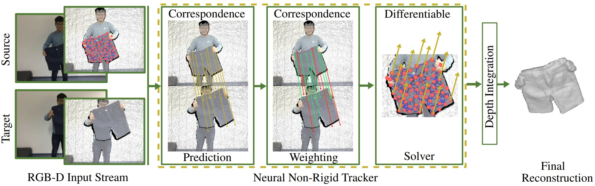

# Neural Non-Rigid Tracking (NeurIPS 2020)

### [Project Page](https://www.niessnerlab.org/projects/bozic2020nnrt.html) | [Paper](https://arxiv.org/abs/2006.13240) | [Video](https://www.youtube.com/watch?time_continue=1&v=nqYaxM6Rj8I&feature=emb_logo) | [Data (TODO)](#)

<p align="center">
  
</p>

This repository contains the code for the NeurIPS 2020 paper [Neural Non-Rigid Tracking](https://arxiv.org/abs/2006.13240), where we introduce a novel, end-to-end learnable, differentiable non-rigid tracker that enables state-of-the-art non-rigid reconstruction. 

By enabling gradient back-propagation through a weighted non-linear least squares solver, we are able to learn correspondences and confidences in an end-to-end manner such that they are optimal for the task of non-rigid tracking. 

Under this formulation, correspondence confidences can be learned via self-supervision, informing a learned robust optimization, where outliers and wrong correspondences are automatically down-weighted to enable effective tracking.

<p align="center">
  
</p>


## Installation

### Set up the conda enviromment

After cloning this repo, `cd` into it and create a conda environment with (hopefully) all required packages:

```
conda env create --file resources/env.yml
```

### Install some C++ extensions ([csrc](csrc))

Then, activate the environment and install some c++ dependencies:

```
conda activate nnrt
cd csrc
python setup.py install
cd ..
```


## I just want to try it on two frames!

If you just want to get a feeling of the whole approach at inference time, you can run

```
python example_viz.py
```

to run inference on a couple of source and target frames that you can already find at [example_data](example_data). For this, you'll be using a model checkpoint that we lso provide at [checkpoints](checkpoints).

Within the [Open3D](http://www.open3d.org/) viewer, you can view the following by pressing these keys:

* `S`: view the source RGB-D frame
* `O`: given the source RGB-D frame, toggle between the complete RGB-D frame and the foreground object we're tracking
* `T`: view the target RGB-D frame
* `B`: view both the target RGB-D frame and the source foreground object
* `C`: toggle source-target correspondences
* `W`: toggle weighted source-target correspondences (the more red, the lower the correspondence's weight)
* `A`: (after having pressed `B`) **align** source to target
* `,`: rotate the camera once around the scene
* `;`: move the camera around while visualizing the correspondences from different angles
* `Z`: reset source object after having aligned with `A`


## Data

bla bla


## Train


## Evaluate

You can run 

```
./run_generate.sh
```

to run inference on a specified split (`train`, `val` or `test`). Within `./run_generate.sh` you can specify your model's directory name and checkpoint name (note that the path to your experiments needs to be defined in `options.py`, by setting `workspace`.)

This script will predict both graph node deformation and dense deformation of the foreground object's points.

Next, you can run 

```
./run_evaluate.sh
```

to compute the `Graph Error 3D` (graph node deformation) and `EPE 3D` (dense deformation).


## Submit to the benchmark


## Known Issues

[Undefined symbol when building cpp extension](https://discuss.pytorch.org/t/undefined-symbol-when-import-lltm-cpp-extension/32627/4)


## Citation
If you find our work useful in your research, please consider citing:

	@article{
	bozic2020neuraltracking,
	title={Neural Non-Rigid Tracking},
	author={Aljaz Bozic and Pablo Palafox and Michael Zoll{\"o}fer and Angela Dai and Justus Thies and Matthias Nie{\ss}ner},
	booktitle={NeurIPS},
	year={2020}
    }

    

## Related work
Some other related work on non-rigid tracking by our group:
* [Bozic et al. - DeepDeform: Learning Non-rigid RGB-D Reconstruction with Semi-supervised Data (2020)](https://niessnerlab.org/projects/bozic2020deepdeform.html)
* [Li et al. - Learning to Optimize Non-Rigid Tracking (2020)](https://niessnerlab.org/projects/li2020learning.html)
